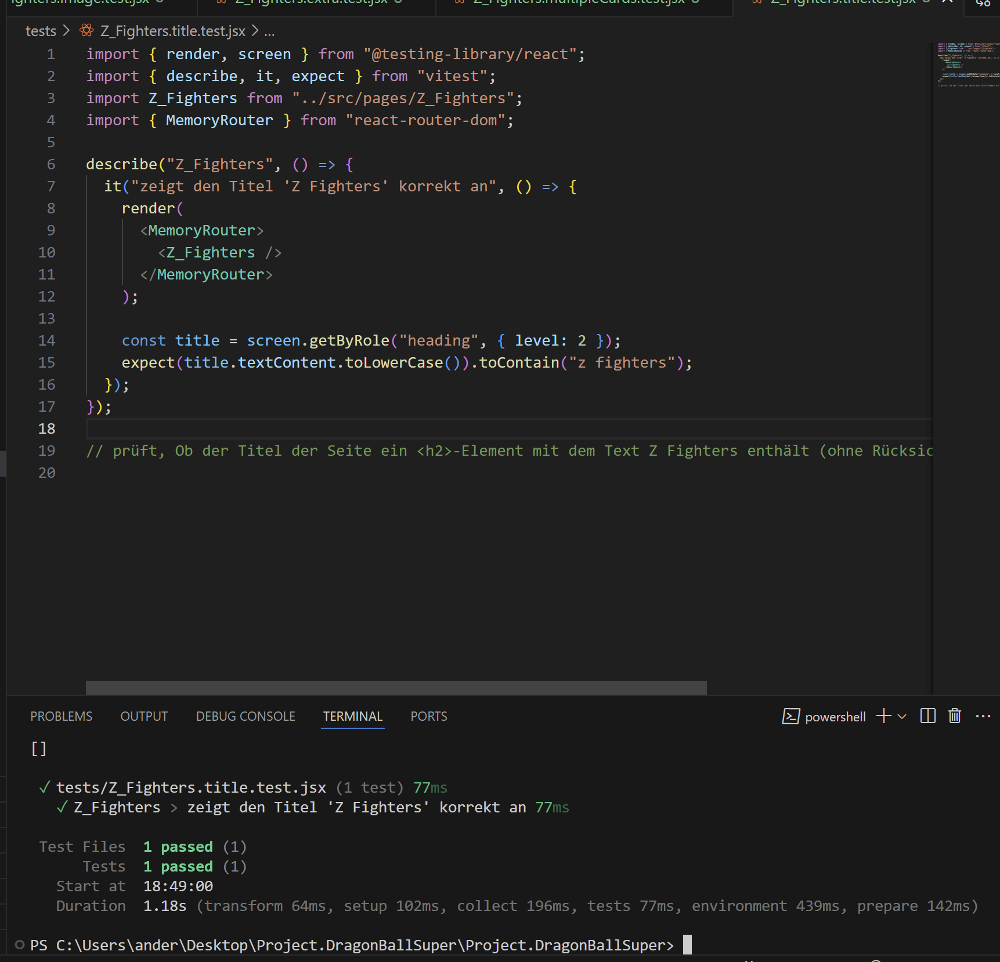
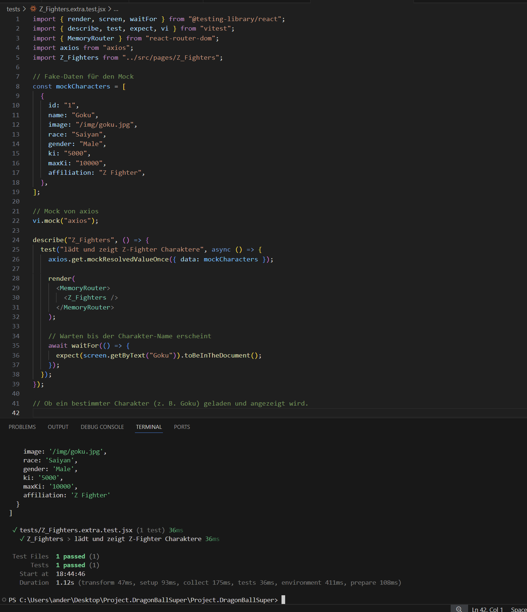
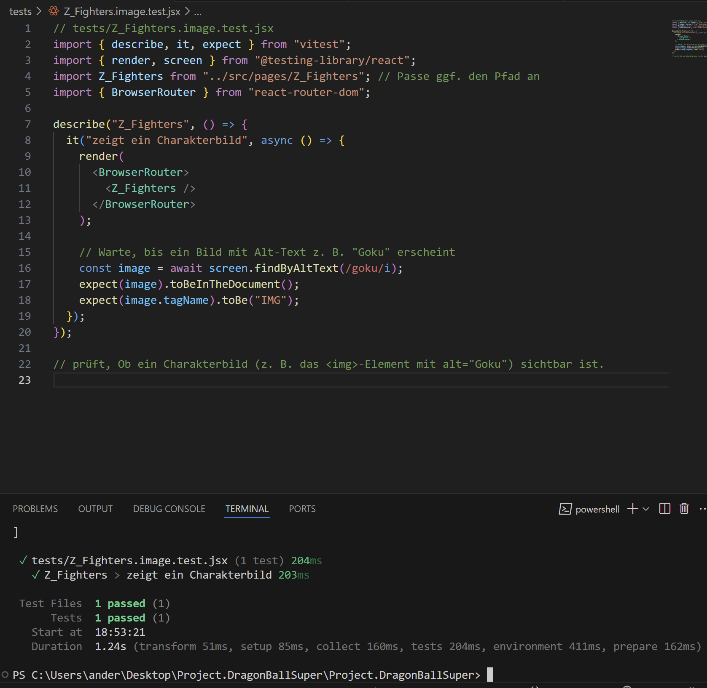
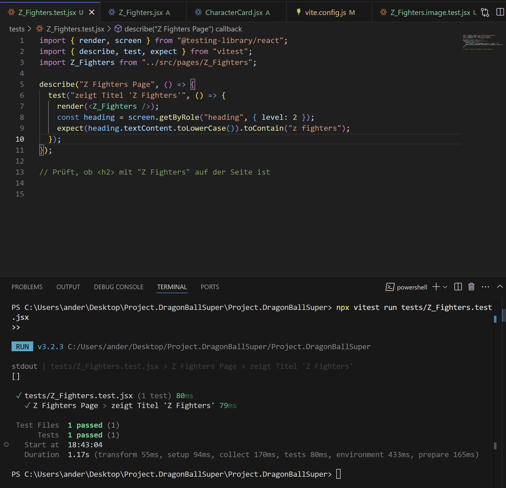

# 🐉 Projektdokumentation – Dragonball Charakter-Datenbank

**Modul:** M294  
**Name:** Thierno Hamidou Bah  
**Klasse:** UIFZ  
**Projekt:** Dragonball Charakter-Datenbank  
**Abgabedatum:** Juni 2025  
**Dozent:** Graziano Spina  

---

## 📌 Motivation

Die Motivation für dieses Projekt entstand durch die Begeisterung für die Dragonball-Serie sowie das Interesse an der Entwicklung datenbasierter React-Anwendungen. Die Herausforderung bestand darin, sowohl externe Daten korrekt zu laden als auch eine Möglichkeit für eigene Benutzerdaten zu schaffen – alles innerhalb einer modernen Frontend-Architektur ohne Backend. Diese App kann theoretisch als Vorlage für andere Serien, Spiele oder universelle Datenverwaltungen dienen. Der Prozess spiegelt ein echtes Projekt im Berufsalltag wider: Planung, Datenfluss, Benutzerinteraktion, Fehlerbehandlung und Deployment. Ein besonderer Fokus lag dabei auf dem Thema State-Management in React, sowie der sauberen Komponententrennung und Wiederverwendbarkeit.

---

## 📄 Inhaltsverzeichnis

1. [Projektidee](#1-projektidee)  
2. [Anforderungskatalog](#2-anforderungskatalog)  
3. [Klassendiagramm](#3-klassendiagramm)  
4. [Storyboard](#4-storyboard)  
5. [Screen-Mockups](#5-screen-mockups)  
6. [REST-Schnittstellen](#6-rest-schnittstellen)  
7. [Testplan](#7-testplan)  
8. [Installationsanleitung](#8-installationsanleitung)  
9. [Hilfestellungen](#9-hilfestellungen)  
10. [Use Cases & Akzeptanzkriterien](#10-use-cases--akzeptanzkriterien)  
11. [Komponentenstruktur](#11-komponentenstruktur)  
12. [Technologien](#12-technologien)  
13. [Datenfluss & Validierung](#13-datenfluss--validierung)  
14. [Fehlerhandling & Unit-Tests](#14-fehlerhandling--unit-tests)  
15. [Fazit & Reflexion](#15-fazit--reflexion)

---

## 1. Projektidee

Die Dragonball Charakter-Datenbank ist eine Webapplikation zur Anzeige, Erweiterung und Verwaltung von Dragonball-Figuren. Basierend auf einer öffentlichen API können bestehende Charaktere angezeigt und neue vom Benutzer hinzugefügt werden. Die App wurde vollständig mit React, CSS und Vite realisiert. Ziel war eine interaktive, dynamische Oberfläche, welche API-Daten und Benutzerinteraktion kombiniert. Sie richtet sich an Fans, Entwickler und Lernende, die praxisnahes Arbeiten mit REST, Routing und Komponenten lernen möchten.

---

## 2. Anforderungskatalog

• API-Daten anzeigen  
• Eigene Charaktere hinzufügen  
• Details einsehen  
• Benutzerdefinierte Charaktere löschen  
• Navigierbare Seitenstruktur  
• REST-artige Datenverarbeitung  
• Validierung von Eingaben  
• Übersichtliche Komponentenstruktur

---

## 3. Klassendiagramm

Die zentrale Klasse ist `Character` mit den Attributen:

- name (String)  
- race (String)  
- ki (Number)  
- maxKi (Number)  
- gender (String)  
- affiliation (String)

---

## 4. Storyboard

1. Startseite zeigt alle API-Charaktere.  
2. Klick auf Karte führt zur Detailansicht.  
3. Button "Neu hinzufügen" öffnet Eingabeformular.  
4. Nach dem Hinzufügen erscheint der Charakter auf Home.  
5. In der Detailansicht sind ein "Löschen" Button und ein "Bearbeiten" Button für benutzerdefinierte Einträge sichtbar.

---

## 5. Screen-Mockups

Die Applikation umfasst folgende Screens:

- Home  
- Villains-Filter  
- Z-Fighters-Filter  
- Detailseite  
- Formularseite  

Das Design orientiert sich an modernen Web-UIs mit klarer Struktur. Die Navigationsleiste ist stets sichtbar. Jede Seite nutzt ein eigenes Layout und eigene Komponenten. Die URL-Leiste sowie Seitentitel passen sich dynamisch an.

---

## 6. REST-Schnittstellen

Verwendet wird die Dragonball REST API:  
https://dragonball-api.com/api/characters

- `GET`: zum Laden der Charaktere  
- `POST/DELETE`: simuliert mit `useState`  
- Kein Server-Speichern – benutzerdefinierte Charaktere werden rein lokal gehalten

---

## 7. Testplan
✅ Z_Fighters.test.jsx
➡️ Prüft, ob die Seite den Titel „Z Fighters“ korrekt anzeigt.

✅ Z_Fighters.extra.test.jsx
➡️ Prüft, ob ein bestimmter Charakter wie „Goku“ angezeigt wird.

✅ Z_Fighters.image.test.jsx
➡️ Prüft, ob das Bild eines Charakters (z. B. alt="Goku") sichtbar ist.

✅ Z_Fighters.multipleCards.test.jsx
➡️ Prüft, ob mehrere Charakterkarten (z. B. 2 oder mehr) dargestellt werden.

✅ Z_Fighters.title.test.jsx
➡️ Prüft, ob es ein <h2>-Titel mit dem Text „Z Fighters“ gibt – egal ob groß oder klein geschrieben.

---

## 8. Installationsanleitung

1. Projekt clonen oder entpacken  
2. `npm install`  
3. `npm run dev`  
4. Öffne http://localhost:5173 im Browser

---

## 9. Hilfestellungen

Technische Unterstützung durch:

- ChatGPT (Code und Beschreibung)  
- Dozent Graziano (Code und Komponentenstruktur)  
- Unterrichtsfolien (Routing, Props, API-Anbindung)  
- Mitschüler (Nico) bei CSS-Optimierung

---

## 10. Use Cases & Akzeptanzkriterien

• Als Benutzer möchte ich eine Liste aller Charaktere sehen  
  Akzeptanzkriterium: Beim Laden der Startseite wird die vollständige Liste der Charaktere angezeigt.  

• Als Benutzer möchte ich Details zu einem Charakter anzeigen lassen  
  Akzeptanzkriterium: Beim Klicken auf eine Charakterkarte wird die Detailansicht geladen.  

• Als Benutzer möchte ich einen eigenen Charakter hinzufügen können  
  Akzeptanzkriterium: Nach dem Ausfüllen und Absenden des Formulars wird der neue Charakter auf der Startseite sichtbar.  

• Als Benutzer möchte ich meine eigenen Charaktere löschen können  
  Akzeptanzkriterium: Nur benutzerdefinierte Charaktere verfügen über einen „Löschen“-Button in der Detailansicht und werden nach dem Löschen aus der Übersicht entfernt.  

• Als Benutzer möchte ich zwischen den verschiedenen Seiten der Anwendung navigieren können  
  Akzeptanzkriterium: Die Navigation funktioniert zuverlässig und ermöglicht den Zugriff auf Home, Villains, Z-Fighters, Detail- und Formularseiten.

---

## 11. Komponentenstruktur

- `App.jsx`: Routing, Navigation  
- `CharacterCard.jsx`: Darstellung eines Charakters  
- `CharacterDetail.jsx`: Detail-View + Delete + Bearbeiten  
- `NeuCharacters.jsx`: Formularseite  
- `Villains.jsx` & `Z_Fighters.jsx`: Filterfunktionen  
- `index.css`, `App.css`: Gestaltung  

`main.jsx` dient zur Initialisierung der App mit ReactDOM, StrictMode und BrowserRouter.

---

## 12. Technologien

- React  
- React Router  
- JavaScript  
- Axios  
- Vite  
- CSS  
- Visual Studio Code

---

## 13. Datenfluss & Validierung

- Daten über `axios` aus API geladen  
- Benutzerdefinierte Daten über `useState` verwaltet  
- Validierung im Formular: erforderliche Felder wie Name, KI, Rasse  
- Keine Aktion bei ungültiger Eingabe  
- Asynchrone Datenverarbeitung im `useEffect`  
- Weitergabe benutzerdefinierter Daten via Props zur Detailseite

---

## 14. Fehlerhandling & Unit-Tests

- Fehlerausgabe über Konsole  
- Kein echtes Backend → keine realen HTTP-Fehler  
- Manuelle Tests durchgeführt  
- Keine automatisierten Tests (z. B. Jest) aus Zeitgründen

---

## 15. Fazit & Reflexion

Das Projekt war erfolgreich. Es erfüllt die Anforderungen, basiert auf einem funktionierenden Konzept und hat mein Verständnis von React, Routing, State-Management und REST-Logik deutlich verbessert. Die IPERKA-Methode half mir, strukturiert zu planen und sauber zu dokumentieren.
